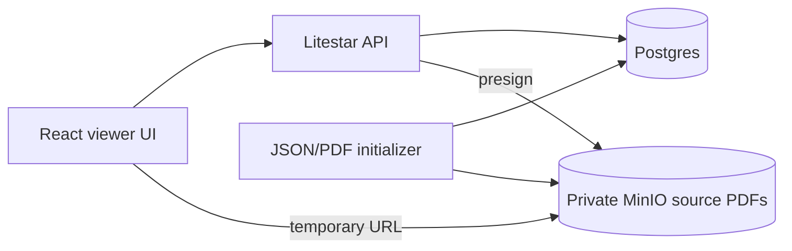

# GoCanopy Asset Management POC

GoCanopy is a proof of concept for browsing asset and lease data with field-level source evidence. The current focus is the viewer workflow: assets and leases are loaded from Postgres, source PDFs are stored privately in MinIO, and the frontend opens a PDF evidence panel that searches and highlights the quoted source text through backend-issued presigned URLs.

## Architecture

- Backend: Litestar, SQLAlchemy async, Advanced Alchemy, Postgres, MinIO, `uv`
- Frontend: React, TypeScript, Vite, Tailwind, React PDF Viewer
- Storage:
  - Postgres stores assets, tenants, leases, provenance JSONB, and `file_index`
  - MinIO stores source PDFs referenced by `file_index`
- Schema: Alembic migrations
- Seed resources: `ressources/warrington_test_data.json` and the bundled Warrington PDF



## Run

```bash
docker compose up --build
```

Open:

- Frontend: http://localhost:5173
- Backend API docs: http://localhost:8000/docs
- MinIO console: http://localhost:9001

Postgres is exposed on `localhost:5433`. Inside Docker, services use `postgres:5432`.

Default local credentials:

- Postgres: `gocanopy` / `gocanopy`
- MinIO: `minioadmin` / `minioadmin`

## Database Schema

Docker runs migrations automatically through the `backend-migrate` service. To run migrations manually:

```bash
docker compose exec backend uv run --no-dev alembic upgrade head
```

For local backend development:

```bash
cd backend
uv run alembic upgrade head
```

## Seed Sample Data

Run the content seeder after the schema exists and the stack is up:

```bash
docker compose exec backend uv run --no-dev python -m app.db.init_from_json /app/ressources/warrington_test_data.json
```

The content seeder:

- upserts assets, tenants, and leases
- preserves provenance JSONB
- uploads the bundled PDF to MinIO under `resources/{safe_filename}`
- upserts a matching `file_index` row

## Current Routes

- `GET /health`
- `GET /api/assets`
- `GET /api/assets/{asset_id}` returns fields with valid source `url` values
- `GET /api/resources/{filename}/url` refreshes an expired source URL

See [docs/routes.md](docs/routes.md) for route details and [docs/database.md](docs/database.md) for the schema.

## Development Checks

Backend:

```bash
cd backend
uv run ruff check .
uv run ruff format --check .
uv run black --check .
uv run pyright app tests
uv run mypy app tests
uv run pytest -q
```

Frontend:

```bash
cd frontend
npm run lint
npm run format:check
npm run typecheck
npm test
npm run build
```

## Scope

Included:

- Asset list and single asset detail page
- Inline lease display
- Field-level provenance buttons
- PDF evidence panel with search/highlight behavior
- Private MinIO source PDFs loaded through short-lived presigned URLs

Out of scope for this POC slice:

- User file uploads
- Background parsing workers
- Authentication and authorization
- Websocket notifications
- Editing or patch history workflows

## Deployment

See the [Deployment Guide](docs/DEPLOYMENT.md) for CI, self-hosted runner, and VPS deployment instructions.
