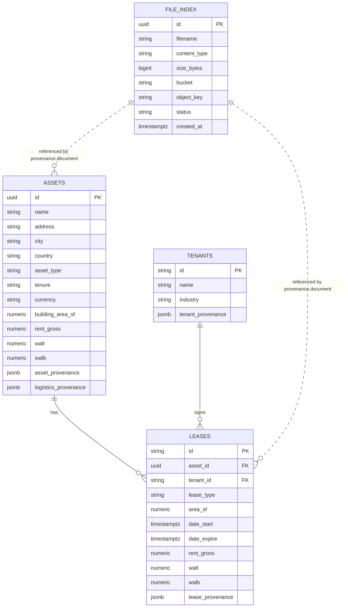

# Database

GoCanopy stores structured asset data in Postgres and source PDFs in private MinIO storage. The database keeps the business entities, the field-level provenance JSON, and a `file_index` catalog row for each source document stored in MinIO. The backend validates `file_index` rows before issuing short-lived presigned URLs for the frontend PDF viewer.

## Tables

| Table | Purpose |
| --- | --- |
| `file_index` | Catalogs source files stored in MinIO, including filename, content type, size, bucket, object key, status, and creation timestamp. |
| `assets` | Stores one row per asset with normalized identity, location, logistics, rent, WALT/WALB, ERV, and asset-level provenance JSONB. |
| `tenants` | Stores one row per tenant with name, industry, and tenant provenance JSONB. |
| `leases` | Stores one row per lease linked to an asset and tenant, including dates, areas, rent, indexation, WALT/WALB, ERV, and lease provenance JSONB. |

## Provenance JSONB

Provenance columns preserve the source evidence used to populate structured fields:

| Column | Table | Notes |
| --- | --- | --- |
| `asset_provenance` | `assets` | Evidence for asset identity, address, country, tenure, currency, and similar asset fields. |
| `logistics_provenance` | `assets` | Evidence for logistics/property metrics such as area, occupancy, height, rent, and ERV. |
| `tenant_provenance` | `tenants` | Evidence for tenant identity and metadata. |
| `lease_provenance` | `leases` | Evidence for lease terms, rent, dates, areas, and ERV. |

Each provenance entry can include:

| Key | Meaning |
| --- | --- |
| `document` | Source PDF filename from the source JSON. The API sanitizes this basename before looking up `file_index.filename`. |
| `source_type` | Expected to be `pdf` for PDF evidence links. |
| `page` | One-based source page hint. |
| `quote` | Text quote the frontend searches and highlights in the PDF viewer. |
| `sheet` | Optional worksheet/source tab when evidence came from spreadsheet-like data. |

## Entity Relationship Diagram

## Seed Data

The initializer reads `ressources/warrington_test_data.json`, upserts the asset/tenant/lease rows, uploads the bundled Warrington PDF into MinIO under `resources/{safe_filename}`, and upserts the matching `file_index` row. The initializer is idempotent.
